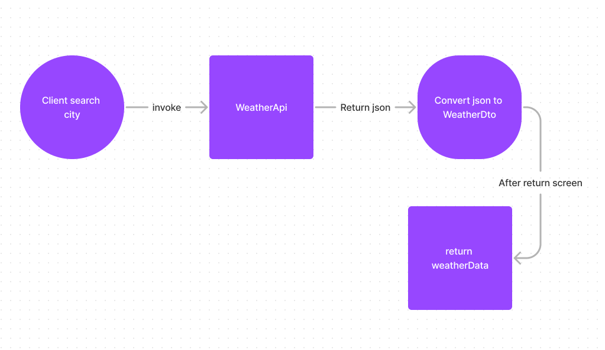
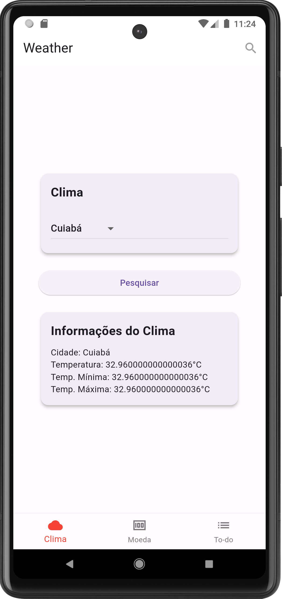
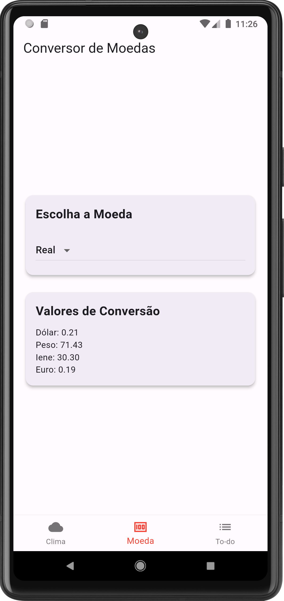
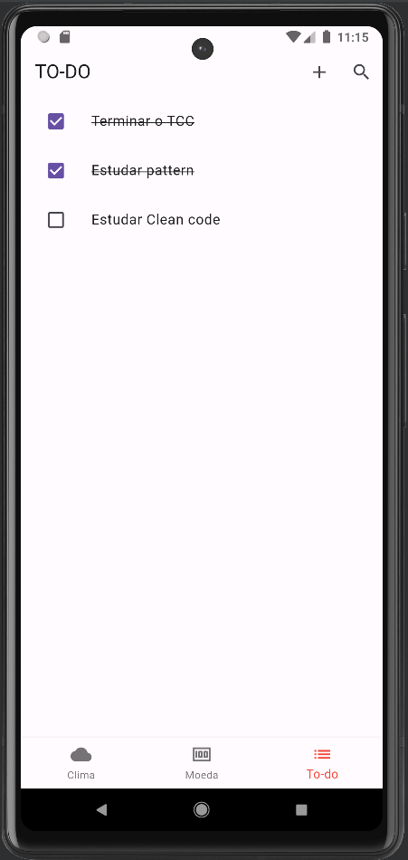

# Test mobile

    This app is result of a test from teacher Lucas Gabriel de Lima Gonçalves

# Screen Weather

- This screen use openweathermap like api
- It works with simple arquiteture
  
  

# Screen Money

- This Screen can choose a money, and after returns the value compared to other currencies
- Use value static, but another update is possible use API
  

# Screen to-do list

- This part you can create a to-do list
- The datas is save in LocalStorage
- ⚠️If clean cache from app, the datas will clean
  

# How work ?

